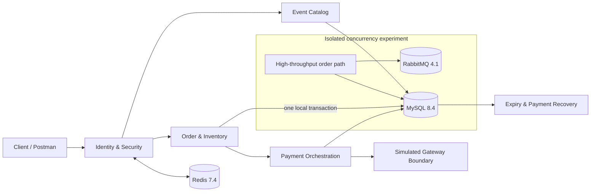

<div align="center">

# Event Trading Platform

### A Java backend that makes the hardest transaction failures executable and testable

**Synchronous ordering · inventory conservation · idempotent retries · payment UNKNOWN recovery · close/payment races · late-charge compensation**

[](https://openjdk.org/projects/jdk/21/)
[](https://spring.io/projects/spring-boot)
[](https://www.mysql.com/)
[](#verification-evidence)
[](docs/verification/CONCURRENCY-EXPERIMENT-1500-RPS-2026-09-18.md)
[](https://github.com/ctmd1234567/event-trading-platform)

[中文](README.md) · [Domain model](docs/architecture/DOMAIN-MODEL.md) · [State machines](docs/architecture/STATE-MACHINES.md) · [API contract](docs/architecture/API-CONTRACT.md) · [Verification](docs/verification/CHECKLIST-0-6.md)

</div>

---

## Why this project is different

This is not a ticketing CRUD app wrapped in a list of technologies. It focuses on real transaction failure boundaries and backs its important claims with deterministic tests:

- **Inventory is a transactional fact, not a cache guess.** One MySQL transaction creates the order and reservation while updating `available / reserved / allocated`, preserving inventory conservation.
- **A network timeout is not a payment failure.** `UNKNOWN / PROCESSING` outcomes converge through the same business number, signed callbacks, queries, and restart recovery without issuing a second charge.
- **Commit order decides race winners.** Payment-first allocates inventory. Close-first releases it, and a later confirmed charge creates exactly one full compensation refund without reopening the order.
- **Tests manufacture the bad paths.** Real MySQL row locks, bounded barriers, lost-response injection, duplicate callbacks, and restarts prove behavior without using `sleep` to guess race order.

## Architecture at a glance



The default product runtime contains Identity/Security, Event Catalog, synchronous Order/Inventory, Payment/Compensation, and recovery jobs. RabbitMQ is used only by the isolated concurrency experiment and does not create core Event orders.

## Core business flow

```text
DRAFT Event
   └─ publish ─> ON SALE
                    └─ create order ─> PENDING_PAYMENT + RESERVED
                                           ├─ payment wins ─> PAID + CONFIRMED + allocated
                                           └─ cancel/expire ─> CLOSED + RELEASED + available
                                                                    └─ late charge
                                                                        └─ one compensation refund
```

Frozen V1 rules: one ticket per order, integer-fen CNY, one order per user and tier, same-key/same-payload replay, and no inventory return after a completed sale refund.

## Implemented capabilities

### Event and synchronous trading

- Event, session, and ticket-tier authoring, publication, off-sale commands, and public reads
- Server-side price snapshots, sale-window validation, and owner-scoped resources
- Synchronous order creation, independent reservation facts, idempotency, and purchase limits
- 1,000 concurrent requests against 100 tickets: 100 reservations, 900 explicit business conflicts, zero technical failures

### Lifecycle and recovery

- User cancellation and timeout closure share one transaction boundary
- Fixed lock order: `order → reservation → ticket tier`
- Persistent expiry scanning, failure backoff, and restart recovery
- Inventory conservation across cancel/expiry and create/release races

### Payment and compensation

- A simulated gateway commits independently from local order transactions
- Payment create/read/refresh, signed callbacks, and persistent recovery
- Queryable `UNKNOWN / PROCESSING / MANUAL_REQUIRED` states
- Exactly one full compensation refund for a confirmed charge after closure, with no second inventory mutation
- Audited ADMIN recovery with the same business number, idempotency key, and reason

## Verification evidence

On 2026-09-18, the current cleanup candidate was verified with IntelliJ IDEA 2026.1.3 and Microsoft OpenJDK 21.0.7:

- **65 default tests** covering identity, security, Event, inventory transactions, payment services, controllers, and the simulated gateway
- **31 Event integration tests**: `EventInfrastructureIT` 3, `EventOrderLifecycleIT` 2, and `PaymentBoundaryIT` 26
- **1 isolated experiment test**: `LegacyMessagingIT` on Testcontainers MySQL, Redis, and RabbitMQ
- A full IDEA rebuild completed with zero compilation problems; all 97 test methods had zero failures and zero ignored tests

See the [0–6 verification record](docs/verification/CHECKLIST-0-6.md) and [cleanup acceptance](docs/verification/REFACTORING-STAGE-D-E-ACCEPTANCE.md) for boundaries and limitations. Flyway 11.7.2 still reports a certification warning for MySQL 8.4; migrations and assertions passed, but that is not a production compatibility certification.

## Quick start

### 1. Requirements

- Java 21
- Maven 3.9+
- Docker Desktop or Docker Engine

Create an untracked `.env` in the project root:

```properties
MYSQL_URL=jdbc:mysql://127.0.0.1:3307/event_trading?useSSL=false&serverTimezone=UTC&allowPublicKeyRetrieval=true
MYSQL_USER=root
MYSQL_PASSWORD=replace-with-a-local-password
REDIS_HOST=127.0.0.1
REDIS_PORT=6380
ADMIN_USER_IDS=1
```

### 2. Run and verify

```bash
docker compose up -d
docker compose ps
mvn test
mvn -Dspring-boot.run.profiles=local spring-boot:run
```

Default Compose starts only MySQL and Redis. The app listens on `http://127.0.0.1:8081`; management endpoints bind to `127.0.0.1:8082`. The `local` profile exposes local verification codes and must never be internet-facing.

Real-dependency integration tests use isolated Testcontainers and do not write to a personal development database:

```bash
mvn -Pinfrastructure verify
```

### 3. Concurrency evidence

The isolated asynchronous-order experiment preserves the stock-bucketing, admission-control, Outbox, and batch-consumer work without making it part of the default product startup. See the [1500 RPS reverification](docs/verification/CONCURRENCY-EXPERIMENT-1500-RPS-2026-09-18.md) for raw k6 summaries and final database evidence.

## API map

- Public catalog: `GET /api/v1/events`, `GET /api/v1/events/{id}`
- ADMIN catalog commands: create events, sessions, tiers, publish, and take off sale
- Owned orders: create, read, list, and cancel
- Payment recovery: create payment, read/refresh payment and compensation refund
- Trusted callback: `POST /api/v1/payment-callbacks/simulated`
- ADMIN recovery: inspect work and retry a payment/refund under the same number

The [API contract](docs/architecture/API-CONTRACT.md) is the source of truth for request and state semantics.

## Project structure

```text
src/main/java/com/eventplatform/
├── catalog/       Event, Session, TicketTier
├── controller/    Event, Order, Payment, Identity APIs
├── order/         Synchronous ordering and expiry; isolated historical experiment
├── payment/       Gateway boundary, callbacks, UNKNOWN recovery, compensation
├── security/      Tokens, codes, authorization, rate limiting
├── service/       Minimal identity service
└── config/        Security, MyBatis, experimental Rabbit configuration

src/main/resources/db/migration/   immutable Flyway V1–V6
src/test/                         unit, concurrency, and Testcontainers acceptance
docs/                             architecture, state machines, API, evidence
loadtest/                         historical experiment; not Event performance
```

## Current boundary and roadmap

- Complete now: V1 checklist items 0–6 and default-runtime cleanup
- Next: item 7 joint Event demo, request collection, and real-write baseline
- V2: Event Notification Outbox/MQ, DLQ/redrive, full user refunds, targeted reconciliation, and dependency-failure evidence
- V3: optional soak, alerting, and backup/recovery evidence; not a completion gate

Not implemented: user-initiated refunds, Event notifications/SSE, Event Outbox/DLQ, generalized reconciliation, and the item-7 performance baseline.

<details>
<summary><strong>1,500 RPS high-throughput order experiment</strong></summary>

On 2026-09-18, the current cleanup candidate passed a warmed local single-instance, 10-second constant-arrival-rate rerun: all 15,001 requests were accepted and finalized, HTTP P95 was 106.51 ms, with zero 429s, HTTP failures, unexpected responses, dropped iterations, or duplicate-user orders; the Outbox and Rabbit queues both drained to zero. The initial cold-start run failed the strict gate and is retained alongside the passing run. This measures the stock-bucketing, admission-control, Outbox, and batch-consumer path—not Event payment throughput, a production SLA, or long-run stability. See the [raw evidence and full boundary](docs/verification/CONCURRENCY-EXPERIMENT-1500-RPS-2026-09-18.md).

</details>

## Design documents

- [Domain model and transaction boundaries](docs/architecture/DOMAIN-MODEL.md)
- [Order, payment, and refund state machines](docs/architecture/STATE-MACHINES.md)
- [API contract](docs/architecture/API-CONTRACT.md)
- [Payment boundary design](docs/architecture/PAYMENT-BOUNDARY-DESIGN.md)
- [Engineering asset register](docs/verification/REFACTORING-STAGE-A-ASSET-REGISTER.md)

If the failure boundaries, tests, or tradeoffs are useful, a ⭐ helps others discover the project. Concrete issues and scenarios are welcome too.
