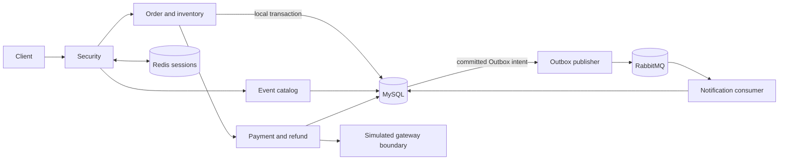

<div align="center">

# Event Ticketing Platform

A reliability-focused Java backend for event ticket ordering, inventory, payments, refunds, and asynchronous recovery.

[](https://openjdk.org/projects/jdk/21/) [](https://spring.io/projects/spring-boot) [](https://www.mysql.com/)   [](https://github.com/ctmd1234567/event-trading-platform/actions/workflows/ci.yml)

[中文](README.md)

</div>

## Overview

Events contain sessions and ticket tiers. An order reserves one ticket; payment, cancellation or expiry determines its outcome. Successful payments can receive one full refund, and committed changes can create in-app notifications. This is a modular monolith. MySQL is the source of truth for transactions and inventory; Redis supports sessions and auxiliary rate limits; RabbitMQ delivers non-core notifications. **Core orders commit synchronously in a local MySQL transaction.**

`Event → Session → TicketTier → Inventory → Order → Payment → Refund → Notification`

## Core capabilities

- Admin event, session and tier publication; sale-window validation and server-side price snapshots.
- Synchronous order creation and reservation, user cancellation, persistent expiry scan and restart recovery.
- Simulated payment gateway, authenticated callbacks, query/recovery, one full user refund and late-charge compensation.
- Transactional notification Outbox, RabbitMQ delivery, in-app reads, dead lettering and audited admin redrive.
- Focused reconciliation with conditional repair only for a precisely verified missing late-charge refund intent.

## Architecture



## Engineering design

### Inventory and idempotency

Each tier maintains nonnegative counters and `available + reserved + allocated = capacity`. The order transaction creates the order and reservation and moves `available → reserved`. Closure releases the reservation and moves `reserved → available`. Normal payment confirmation moves `reserved → allocated`. A replay with the same user, key and payload returns the original order; the same key with different parameters conflicts. Database uniqueness and conditional updates are the final correctness guards. Overload returns a controlled HTTP 429; a successful response follows the MySQL commit. A completed-sale refund does not return allocated inventory to sale.

### Payment uncertainty and close races

A network timeout is not payment failure. `UNKNOWN / PROCESSING` results converge through callback, gateway query and recovery with the same business number. If payment commits first, `PENDING_PAYMENT → PAID` and reserved inventory becomes allocated. If closure commits first, `PENDING_PAYMENT → CLOSED` and reserved inventory becomes available. A later confirmed charge creates one full compensation refund while the order remains closed.

### Reliable messaging, refund and reconciliation

A business change and its Outbox intent commit in one MySQL transaction. Publishing uses leases, bounded retry, Publisher Confirm and mandatory Return. The consumer commits a notification before ACK and deduplicates by `event_id`; delivery is at least once. Poison messages enter a DLQ and admins can perform audited redrive. A Confirm does not prove the final notification effect, and a DLQ is not a zero-loss guarantee. One order has one payment and at most one full refund. Uncertain refunds recover under the same refund number. Reconciliation conditionally repairs only a proven late-charge refund gap; other contradictions need manual review.

## Verification

A [local Maven report](docs/engineering/results/local-maven-reports-20260925.txt) records 65 default tests and 82 Testcontainers integration tests: **147 total, zero failures, errors or skips**. Coverage includes real MySQL and RabbitMQ, deterministic concurrency and payment/close races, broker outage, Redis failure, and process recovery. Both local `mvn test` and `mvn -Pinfrastructure verify` exited 0; the [report summary](docs/engineering/results/local-maven-reports-20260925.txt) provides suite detail. Hosted CI is independent. See [Testing](docs/engineering/TESTING.md).

Local synchronous-order load used isolated tiers and users at a fixed arrival rate for five seconds per run. A repeated single-hot-tier run at 150/s committed 750/750 orders with no controlled rejection or technical failure and P95 15.15 ms. At 250/s on that tier, 898 writes committed, 353 requests received controlled HTTP 429 responses, none failed technically, and P95 was 370.50 ms. Three tiers at 500/s committed 2501/2501 orders with P95 21.39 ms. Each committed write matched the MySQL order, reservation and inventory audit. These short local results do not establish sustained capacity or a production SLA; [Performance](docs/engineering/PERFORMANCE.md) records cold-run variation, P50/P99, dropped iterations and all rounds.

## Quick start

Requires Java 21, Maven 3.9+, and Docker. Create an untracked local `.env`:

```properties
MYSQL_URL=jdbc:mysql://127.0.0.1:3307/event_trading?useSSL=false&serverTimezone=UTC&allowPublicKeyRetrieval=true
MYSQL_USER=root
MYSQL_PASSWORD=replace-with-a-local-password
REDIS_HOST=127.0.0.1
REDIS_PORT=6380
ADMIN_USER_IDS=1
RABBITMQ_USER=event_app
RABBITMQ_PASSWORD=replace-with-a-local-password
RABBITMQ_PORT=5673
```

```bash
docker compose up -d
mvn test
mvn -Dspring-boot.run.profiles=local spring-boot:run
mvn -Pinfrastructure verify
```

The application listens on `127.0.0.1:8081` and management endpoints on `127.0.0.1:8082`. The `local` profile returns local verification codes and is for local use only. Integration tests use isolated Testcontainers dependencies.

## Local demo

Include the demo admin identity in `ADMIN_USER_IDS`, or supply an authenticated allowlisted `DEMO_ADMIN_TOKEN`. The script creates a fresh event, session and three tiers and checks payment, cancellation, expiry, ownership denial and inventory conservation:

```bash
EVENT_ORDER_PAYMENT_WINDOW_SECONDS=30 mvn -Dspring-boot.run.profiles=local spring-boot:run
bash scripts/demo-v1.sh
```

A [Postman collection](postman/collections/Event-V1.postman_collection.json) provides request examples.

## Structure and documentation

`src/` contains application code, migrations and tests; `docs/` holds architecture and engineering evidence; `loadtest/` contains isolated workload drivers and SQL audits; `postman/` contains requests; `scripts/` contains the demo and report gate.

[Domain model](docs/architecture/DOMAIN-MODEL.md) · [State machines](docs/architecture/STATE-MACHINES.md) · [Payment boundary](docs/architecture/PAYMENT-BOUNDARY-DESIGN.md) · [API contract](docs/architecture/API-CONTRACT.md) · [Reliability](docs/engineering/RELIABILITY.md) · [Performance](docs/engineering/PERFORMANCE.md) · [Testing](docs/engineering/TESTING.md)
