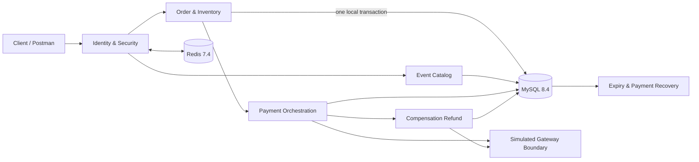

<div align="center">

# Event Trading Platform

### A Java backend for event orders, inventory, payments, and recovery

**Synchronous ordering · inventory conservation · idempotent retries · payment UNKNOWN recovery · close/payment races · late-charge compensation**

[](https://openjdk.org/projects/jdk/21/)
[](https://spring.io/projects/spring-boot)
[](https://www.mysql.com/)
[](#verification-evidence)
[](https://github.com/ctmd1234567/event-trading-platform/actions/workflows/ci.yml)

[中文](README.md) · [Domain model](docs/architecture/DOMAIN-MODEL.md) · [State machines](docs/architecture/STATE-MACHINES.md) · [API contract](docs/architecture/API-CONTRACT.md) · [V1 verification](docs/verification/V1-VERIFICATION.md)

</div>

---

## Project focus

The project implements Event transaction boundaries and failure recovery, with tests and acceptance records for its key behaviors:

- **Inventory is a transactional fact, not a cache guess.** One MySQL transaction creates the order and reservation while updating `available / reserved / allocated`, preserving inventory conservation.
- **A network timeout is not a payment failure.** `UNKNOWN / PROCESSING` outcomes converge through the same business number, signed callbacks, queries, and restart recovery without issuing a second charge.
- **Commit order decides race winners.** Payment-first allocates inventory. Close-first releases it, and a later confirmed charge creates exactly one full compensation refund without reopening the order.
- **Tests manufacture the bad paths.** Real MySQL row locks, bounded barriers, lost-response injection, duplicate callbacks, and restarts prove behavior without using `sleep` to guess race order.

## Architecture at a glance



The core Event trade remains a synchronous MySQL transaction. Payment success and order closure persist notification intent in that transaction. RabbitMQ carries only this side effect and never creates core orders. Item 9 adds broker outage recovery, bounded consumer retry, a DLQ, and audited admin redrive. The old Voucher messaging experiment remains profile-isolated.

## Core business flow

```text
DRAFT Event
   └─ publish ─> ON SALE
                    └─ create order ─> PENDING_PAYMENT + RESERVED
                                           ├─ payment wins ─> PAID + CONFIRMED + allocated
                                           └─ cancel/expire ─> CLOSED + RELEASED + available
                                                                    └─ late charge
                                                                        └─ one compensation refund
```

Frozen V1 rules: one ticket per order, integer-fen CNY, one order per user and tier, same-key/same-payload replay, and no inventory return after a completed sale refund.

## Implemented capabilities

### Event and synchronous trading

- Event, session, and ticket-tier authoring, publication, off-sale commands, and public reads
- Server-side price snapshots, sale-window validation, and owner-scoped resources
- Synchronous order creation, independent reservation facts, idempotency, and purchase limits
- 1,000 concurrent requests against 100 tickets: 100 reservations, 900 explicit business conflicts, zero technical failures

### Lifecycle and recovery

- User cancellation and timeout closure share one transaction boundary
- Fixed lock order: `order → reservation → ticket tier`
- Persistent expiry scanning, failure backoff, and restart recovery
- Inventory conservation across cancel/expiry and create/release races

### Payment and compensation

- A simulated gateway commits independently from local order transactions
- Payment create/read/refresh, signed callbacks, and persistent recovery
- Queryable `UNKNOWN / PROCESSING / MANUAL_REQUIRED` states
- Exactly one full compensation refund for a confirmed charge after closure, with no second inventory mutation
- Audited ADMIN recovery with the same business number, idempotency key, and reason

## Verification evidence

On 2026-09-19, the current V1 candidate was verified with Microsoft OpenJDK 21.0.7 and Maven 3.9.16:

- **65 default tests** covering identity, security, Event, inventory transactions, payment services, controllers, and the simulated gateway
- **58 infrastructure-profile integration tests**: 57 cover Event V1, plus one isolated historical RabbitMQ experiment test
- **123 tests in total** with zero failures, errors, or skips; `mvn -Pinfrastructure verify` runs both the default and Testcontainers integration suites
- **Event order baseline**: 200 authenticated `POST /api/v1/orders` calls produced 100 successes, 100 explicit business conflicts, zero technical failures, and zero dropped attempts; P50/P95/P99 were 0.012996/0.040840/0.048521 seconds and all inventory and relationship audits passed

See the [V1 verification record](docs/verification/V1-VERIFICATION.md) and [Event order baseline result](docs/verification/results/event-order-creation-baseline-20260919.md) for commands, Demo evidence, versions, database audits, boundaries, and limitations. Flyway 11.7.2 still reports a certification warning for MySQL 8.4; migrations and assertions passed, but that is not a production compatibility certification.

## Run

### Requirements

- Java 21
- Maven 3.9+
- Docker Desktop or Docker Engine

Create an untracked `.env` in the project root:

```properties
MYSQL_URL=jdbc:mysql://127.0.0.1:3307/event_trading?useSSL=false&serverTimezone=UTC&allowPublicKeyRetrieval=true
MYSQL_USER=root
MYSQL_PASSWORD=replace-with-a-local-password
REDIS_HOST=127.0.0.1
REDIS_PORT=6380
ADMIN_USER_IDS=1
RABBITMQ_USER=event_app
RABBITMQ_PASSWORD=replace-with-a-local-password
RABBITMQ_PORT=5673
EVENT_NOTIFICATIONS_ENABLED=true
```

### Start and verify

```bash
docker compose up -d
docker compose ps
mvn test
mvn -Dspring-boot.run.profiles=local spring-boot:run
```

Default Compose starts MySQL, Redis, and one persistent RabbitMQ node. Set `EVENT_NOTIFICATIONS_ENABLED=false` to run without the broker; trades still persist pending Outbox intent. The app listens on `http://127.0.0.1:8081`; management endpoints bind to `127.0.0.1:8082`. The `local` profile exposes local verification codes and must never be internet-facing.

Real-dependency integration tests use isolated Testcontainers and do not write to a personal development database:

```bash
mvn -Pinfrastructure verify
```

### V1 demo

Start the application with the `local` profile and include the demo ADMIN identity in `ADMIN_USER_IDS`, or pass an authenticated, allowlisted `DEMO_ADMIN_TOKEN`. The script creates a fresh Event, Session, and three independent TicketTiers without relying on historical business IDs. Use a 30-second payment window to demonstrate expiry:

```bash
EVENT_ORDER_PAYMENT_WINDOW_SECONDS=30 mvn -Dspring-boot.run.profiles=local spring-boot:run
bash scripts/demo-v1.sh
```

The demo covers login, dynamic catalog setup and publication, public reads, idempotent order and payment replay, ownership denial, user cancellation, expiry closure, and final order/payment state and inventory conservation across three tiers. The existing callable collection remains at [`postman/collections/Event-V1.postman_collection.json`](postman/collections/Event-V1.postman_collection.json).

The Event order baseline uses an isolated Event/TicketTier and Redis sessions. Independent authenticated users concurrently call `POST /api/v1/orders`; the runner records successes, business conflicts, technical failures, and P50/P95/P99, then audits inventory conservation and duplicate effective orders/reservations:

```bash
RESULT_FILE=docs/verification/results/event-order-creation-baseline.md \
  bash loadtest/event-trading-baseline.sh
```

## API map

- Public catalog: `GET /api/v1/events`, `GET /api/v1/events/{id}`
- ADMIN catalog commands: create events, sessions, tiers, publish, and take off sale
- Owned orders: create, read, list, and cancel
- Payment recovery: create payment, read/refresh payment and compensation refund
- Trusted callback: `POST /api/v1/payment-callbacks/simulated`
- ADMIN recovery: inspect work and retry a payment/refund under the same number

The [API contract](docs/architecture/API-CONTRACT.md) is the source of truth for request and state semantics.

## Project structure

```text
src/main/java/com/eventplatform/
├── catalog/       Event, Session, TicketTier
├── controller/    Event, Order, Payment, Identity, Notification APIs
├── notification/  Event Outbox, RabbitMQ publisher/consumer, in-app reads
├── order/         Synchronous ordering and expiry; isolated historical experiment
├── payment/       Gateway boundary, callbacks, UNKNOWN recovery, compensation
├── security/      Tokens, codes, authorization, rate limiting
├── service/       Minimal identity service
└── config/        Security, MyBatis, experimental Rabbit configuration

src/main/resources/db/migration/   Flyway V1–V6 preserved; V7/V8 add notification and recovery tables
src/test/                         unit, concurrency, and Testcontainers acceptance
docs/                             architecture, state machines, API, evidence
postman/                          Event V1 collection and local environment
scripts/                          V1 joint demo
loadtest/                         Event baseline and isolated historical experiment
```

## Current boundary and roadmap

- Complete now: V1 Core Trading; see the [V1 verification record](docs/verification/V1-VERIFICATION.md)
- V2 item 8: Event Notification Outbox/MQ and in-app notifications; see the [item 8 record](docs/verification/CHECKLIST-8-EVENT-NOTIFICATIONS.md)
- V2 item 9: broker outage recovery, notification DLQ, and audited admin redrive; see the [item 9 record](docs/verification/CHECKLIST-9-MQ-RECOVERY.md)
- Later V2 items: full user refunds, targeted reconciliation, and dependency-failure evidence
- V3: optional soak, alerting, and backup/recovery evidence; not a completion gate

Not implemented: user-initiated refunds, SSE delivery, generalized reconciliation, and complete OpenAPI. Authenticated users can query their latest 100 notifications with `GET /api/v1/notifications`; admins can redrive after investigating the cause. A DLQ and single-node persistence are not a zero-loss guarantee.

High-throughput engineering experiment (isolated Voucher/Outbox/RabbitMQ write path, including the failed cold-start round, limitations, and raw evidence): [1,500 RPS experiment record](docs/verification/CONCURRENCY-EXPERIMENT-1500-RPS-2026-09-18.md). It is not an Event performance result, production SLA, or long-run stability claim.

## Design documents

- [Domain model and transaction boundaries](docs/architecture/DOMAIN-MODEL.md)
- [Order, payment, and refund state machines](docs/architecture/STATE-MACHINES.md)
- [API contract](docs/architecture/API-CONTRACT.md)
- [Payment boundary design](docs/architecture/PAYMENT-BOUNDARY-DESIGN.md)
