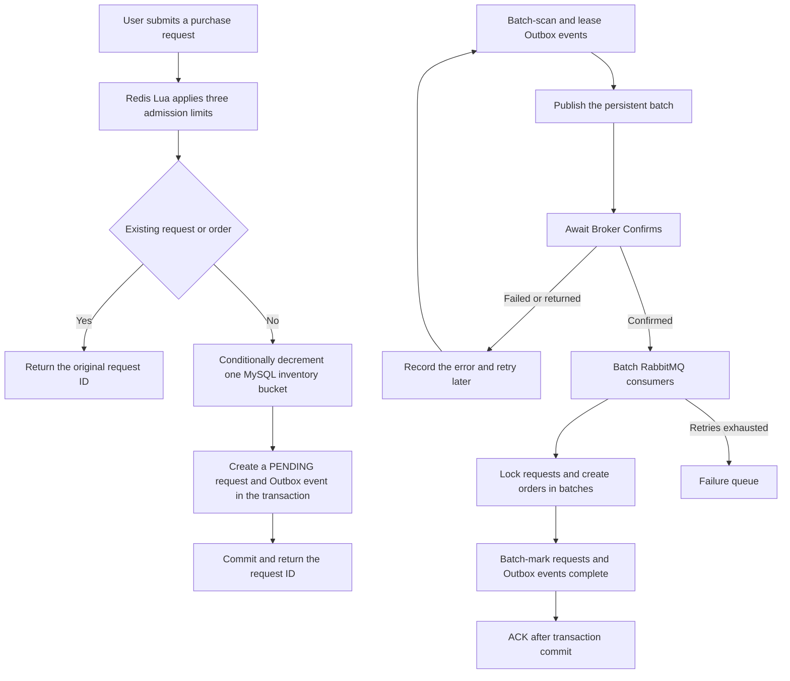

# High-Concurrency Event Trading Platform

[Chinese](README.md) | [English](README.en.md)

A modular-monolith transaction backend built with Java 21, Spring Boot, MySQL, Redis, and RabbitMQ. The V1 event path creates an order and reserves ticket-tier inventory synchronously; the original voucher and Outbox/RabbitMQ path remains as a compatibility capability.

## Current Implementation Scope

The current baseline implements event, session, and ticket-tier creation, publication, and queries; synchronous orders and inventory reservations; unpaid-order cancellation; database-driven closure; idempotent release; and restart scans. The V1 payment boundary now includes V6 persistence, an independently committed simulated gateway, `UNKNOWN` query/callback recovery, payment-versus-close races, one late-payment compensation refund, owned query/refresh routes, and ADMIN recovery routes. On 2026-09-17, IDEA with Microsoft OpenJDK 21.0.7 passed 26 H2 payment-contract tests, 26 MySQL 8.4 payment-boundary tests, and 7 HTTP/security tests, with no failures or skips. See the [0-6 verification record](docs/verification/CHECKLIST-0-6.md) for scope, evidence, and limitations.

## Highlights

- **MySQL transaction source of truth:** sixteen inventory buckets spread writes for one voucher, while conditional updates and unique constraints prevent overselling and duplicate orders; Redis does not store final transaction state.
- **V1 event-trading baseline:** an event contains multiple sessions and ticket tiers; one order buys one ticket, snapshots the server-side price, and commits the order and `RESERVED` record in one MySQL transaction.
- **Recoverable payment boundary:** simulated-provider results commit independently; a lost response remains `UNKNOWN` and recovers under the original payment number, while a charge confirmed after closure creates only one same-number-retry compensation refund and never changes inventory again.
- **Short transactions and overload protection:** idempotency reads occur outside the transaction, while a fair semaphore bounds in-flight database work and returns `429` quickly under overload.
- **Transactional publishing intent:** inventory deduction, request creation, and the Outbox event commit in one database transaction; a consumer creates the final order.
- **Asynchronous messaging:** leased Outbox batches, Confirm/Return checks, persistent messages, transactional batch consumption, a failure queue, and scheduled redelivery are implemented; these mechanisms do not establish that every failure scenario has been tested.
- **Idempotent requests:** repeating the same purchase returns the original request ID without deducting stock again.
- **Layered admission control:** one Redis `TIME`-based Lua token-bucket call enforces per-user, per-voucher, and global request limits.
- **Observability:** a dedicated management port exposes Prometheus metrics for the connection pool, reservation latency, completion lag, admission rejection, and Outbox backlog.
- **Security boundaries:** token authentication, administrator authorization, atomic code consumption, rate limiting, and request identity cleanup.
- **Automated verification:** the accepted checklist 0-5 baseline passed 38 default tests; its isolated tests cover Flyway V1-V5, real MySQL, Redis, RabbitMQ, 1,000-request inventory contention, and order lifecycle. Item 6 was separately verified in IDEA by 26 H2 payment-contract, 26 MySQL 8.4 payment-boundary, and 7 HTTP/security tests; the complete default suite was not rerun for this update.

## Technology Stack

- Java 21 and Spring Boot 3.5
- Spring Security and MyBatis-Plus
- MySQL 8, Redis, and RabbitMQ
- Maven and Docker Compose
- JUnit 5, H2, Mockito, Testcontainers, and k6

## Compatibility Voucher Workflow



The publisher checks both Confirm ACK and Return. A confirm does not prove successful consumer processing or, by itself, routing to the intended queue. The consumer commits request state, final orders, and Outbox completion in one local transaction; the Spring listener container acknowledges afterward. Business uniqueness constraints and request state protect against duplicate delivery.

The current Outbox `completed` flag means consumer processing completed, not merely successful publication. Events can be republished after lease expiry even after broker confirmation, until the consumer commits. Moving a consumer message to the failure queue does not automatically stop scheduled database publication. This is not an end-to-end bounded-retry or complete DLQ-redrive guarantee.

## Implemented Features

### Identity and security

- SMS-code login and token authentication.
- Sliding token expiration and explicit logout.
- Administrative endpoint authorization.
- Authentication-code and source-IP rate limiting.
- Image type, size, pixel-count, and owner validation.

### Transactions and consistency

- Minimal event, session, and ticket-tier creation, publication, sale stopping, and public queries.
- Synchronous event-order creation with a server-side CNY-fen price snapshot and separate reservation record.
- Replay of the original order for one user and idempotency key, plus a one-order-per-user-and-tier limit.
- Authenticated ownership filters for order details and lists; another user's lookup returns not found.
- Independently persisted simulated payments, signed callbacks, `UNKNOWN`/startup recovery, and same-business-number idempotent recovery.
- One-time reservation confirmation when payment wins; one full compensation refund when closure wins, with no refund inventory mutation.
- Owned payment/compensation-refund query and refresh routes plus audited, idempotent ADMIN retries.
- Vouchers and limited-time purchases.
- Conditional database inventory deduction.
- Sixteen MySQL inventory buckets per voucher to spread row-lock contention.
- Per-user, per-voucher, and global admission control.
- Fair in-flight transaction limits and fast overload rejection.
- Idempotency for each user and voucher pair.
- Order request states: `PENDING` and `COMPLETED`.
- Transactional Outbox batch publishing and scheduled redelivery.
- RabbitMQ persistence, Confirm, Return, concurrent consumption, retries, and failure queue.
- Prometheus metrics for orders, the connection pool, and Outbox state.

### Existing compatibility features

The repository also contains the following shop and social endpoints. Their presence does not establish a complete event-trading domain:

- Shop caching, null caching, and logical expiration.
- Shop category queries.
- Posts, likes, follows, and check-ins.
- Image upload, retrieval, and deletion.

## Quick Start

### Requirements

- Java 21
- Maven 3.6.3+
- Docker Desktop

### 1. Configure environment variables

Create `.env` in the project root:

```properties
MYSQL_URL=jdbc:mysql://127.0.0.1:3307/event_trading?useSSL=false&serverTimezone=UTC&allowPublicKeyRetrieval=true
MYSQL_USER=root
MYSQL_PASSWORD=replace-with-a-local-password

REDIS_HOST=127.0.0.1
REDIS_PORT=6380

RABBITMQ_HOST=127.0.0.1
RABBITMQ_PORT=5673
RABBITMQ_USER=event_app
RABBITMQ_PASSWORD=replace-with-a-local-password
```

`.env` is ignored by Git. Never commit real credentials.

### 2. Start the infrastructure

```powershell
docker compose up -d
docker compose ps
```

Default ports: MySQL `3307`, Redis `6380`, RabbitMQ `5673`, and RabbitMQ management UI `15673`.

The current source contains Flyway `V1` through `V6`; V6 adds local payment/refund, callback/history, and independent simulated-gateway result tables. On 2026-09-17, `PaymentBoundaryIT` verified all six migrations on a clean MySQL 8.4 database. An existing local database may be baselined at version `2` only after confirming that it already contains the historical base tables and the order/Outbox upgrade; later migrations are then applied, and Flyway clean is disabled. Test seed data exists only under `src/test/resources` and is never loaded into the development database.

### 3. Start the application

```powershell
mvn test
mvn '-Dspring-boot.run.profiles=local' spring-boot:run
```

The service listens on `http://127.0.0.1:8081`. The `local` profile returns a development verification code and must only be used for local testing.

## Testing

Default tests do not connect to a personal database:

```powershell
mvn test
```

Rerun on 2026-09-15 with the Microsoft OpenJDK 21.0.7 configured by the IDEA project and Maven 3.9.16: **38 tests passed, 0 failed, 0 errors, 0 skipped**.

Run isolated integration tests against real MySQL, Redis, and RabbitMQ services:

```powershell
mvn -Pinfrastructure verify
```

On the same date, `InfrastructureIT` was run directly by IDEA: **2 tests passed, 0 failed**. It verifies ordered Flyway `V1` through `V5` migration on an empty MySQL 8.4 database plus real-MySQL event ordering, Redis, RabbitMQ, and 1,000 valid requests contending for 100 tickets: 100 reservations succeeded, 900 were business rejections, and none failed technically, with inventory and reservation conservation verified. `EventOrderLifecycleIT` also passed both tests, covering the 30-second TTL, one-second scan, cancel-versus-expiry and same-tier create-versus-close races, inventory release, and restart recovery; four overdue orders were processed about 43 ms after the restarted application became ready. A separate default-suite test verifies that persisted failure backoff does not starve later candidates. Flyway 11.7.2 warns that its database recognition table has not certified MySQL 8.4; the migrations and assertions pass, but the compatibility warning remains a known limitation. Direct IDEA runs do not create Maven Failsafe reports, so these results are evidenced by the test classes' exit code 0 and complete console output.

On 2026-09-17, focused checklist-item-6 acceptance ran through IDEA with Microsoft OpenJDK 21.0.7: `EventPaymentServiceTest` passed **26 tests**, real-MySQL-8.4 `PaymentBoundaryIT` passed **26 tests**, and the payment controller, callback, ADMIN recovery, and security regression classes passed **7 tests** in total; all had zero failures and zero skips. Bounded barriers, real row-lock hooks, and fault injection select race order; no `sleep` is used as race proof. Coverage includes normal payment, lost-response recovery, payment-first, closure-first with exactly one compensation refund, duplicate callbacks/retries, manual handoff, no new charge after closure, and no second inventory change after late payment. This update did not rerun the 38-test complete default suite, run an item-7 joint demo, or benchmark payment throughput. See the [0-6 verification record](docs/verification/CHECKLIST-0-6.md).

## Load Testing

`loadtest/` contains a fixed-arrival-rate test for the real order write path, isolated voucher data, and expiring synthetic user tokens. After preparing the isolated data, run:

```powershell
$env:RATE='1500'
$env:DURATION_SECONDS='10'
$env:VOUCHER_ID='9900021600'
$env:BASE_URL='http://127.0.0.1:8081'
k6 run .\loadtest\order-capacity.js
```

Capacity runs start the application with temporary per-voucher and global limits of `5000`, so protective limits do not hide the system boundary; normal defaults remain `420/s` per voucher and `800/s` globally. Local single-instance environment: Windows 11, Java 21, Docker MySQL 8.4, Redis 7.4, RabbitMQ 4.1, and k6 v2.2.0. Each request calls the authenticated write endpoint with a distinct synthetic user while RabbitMQ consumers run concurrently. Post-run checks cover inventory, request rows, final orders, duplicate orders, and Outbox backlog.

Previously recorded 10-second fixed-arrival-rate results (not rerun for this documentation update):

P95 below measures the purchase HTTP request, not asynchronous order completion or payment latency. Final orders and Outbox state are checked separately after request acceptance. Each result is limited to the stated experimental conditions.

- 1000 target RPS: P95 34.69 ms; 10,001 requests and final orders; zero rejection, errors, dropped iterations, duplicate orders, or Outbox backlog.
- 1200 target RPS: P95 12.77 ms; 12,001 requests and final orders; zero rejection, errors, dropped iterations, duplicate orders, or Outbox backlog.
- 1400 target RPS: P95 17.1 ms; 14,001 requests and final orders; zero rejection, errors, dropped iterations, duplicate orders, or Outbox backlog.
- 1500 target RPS: P95 14.82 ms; 15,001 requests and final orders; zero rejection, errors, dropped iterations, duplicate orders, or Outbox backlog.
- 1600 target RPS: P95 109.13 ms; 15,848 of 16,001 requests accepted and 153 received a controlled `429`; no unexpected responses or dropped iterations; every accepted request became one order, with no duplicates or Outbox backlog.

With strict criteria of P95 below one second, zero `429` responses, zero unexpected responses or dropped iterations, no overselling or duplicate orders, and a fully drained Outbox, the highest passing recorded level is 1500 target RPS. The 1600 level produced controlled rejections and failed those criteria. This is a 10-second local single-instance baseline, not an exact maximum capacity, production SLA, payment/refund throughput, or long-running stability result.

## Project Layout

```text
event-trading-platform/
├─ src/main/java/com/eventplatform/
│  ├─ config/          # Security, persistence, and messaging
│  ├─ controller/      # HTTP APIs
│  ├─ order/           # Order transactions and Outbox
│  ├─ security/        # Tokens, codes, and rate limits
│  ├─ service/         # Business logic
│  └─ upload/          # Image storage
├─ src/main/resources/
│  ├─ db/              # Initialization and upgrade scripts
│  └─ mapper/          # MyBatis XML
├─ src/test/           # Unit, regression, and integration tests
├─ docs/               # Architecture and engineering notes
├─ loadtest/           # k6 write-path tests and isolated data
├─ postman/            # API requests
├─ compose.yaml
└─ pom.xml
```

## Runtime Boundaries

- MySQL is the final source of truth for inventory and orders; Redis provides caching, sessions, and admission control.
- Inventory for one voucher is spread across sixteen MySQL row buckets and summed on reads; existing databases migrate through `db/performance-upgrade.sql`.
- The legacy purchase endpoint returns a request ID and RabbitMQ creates the final voucher order asynchronously; `/api/v1/orders` creates the event order synchronously in a local transaction.
- The simulated gateway and local payment state use separate transactions on the same physical MySQL. This verifies a durable boundary, not real funds or a separate-database failure domain. V1 has no user-initiated refund and emits no new payment/refund MQ events.
- Management port `127.0.0.1:8082` exposes only health and Prometheus endpoints.
- The local Compose stack is for development and verification, not a production deployment environment.

## Documentation

The architecture documents include target designs and should be distinguished from the current implementation scope above.

- [Security and consistency](docs/SECURITY-FIXES.md)
- [Domain model design](docs/architecture/DOMAIN-MODEL.md)
- [Business state machine design](docs/architecture/STATE-MACHINES.md)
- [API contract design](docs/architecture/API-CONTRACT.md)
- [Payment boundary design](docs/architecture/PAYMENT-BOUNDARY-DESIGN.md)
- [Checklist 0-6 verification](docs/verification/CHECKLIST-0-6.md)
