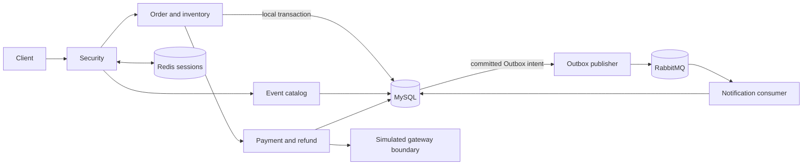

<div align="center">

# Event Ticketing Platform

面向活动票务交易场景的 Java 后端系统，重点解决库存一致性、支付不确定性、补偿退款和可靠异步通知。

[](https://openjdk.org/projects/jdk/21/) [](https://spring.io/projects/spring-boot) [](https://www.mysql.com/)   [](https://github.com/ctmd1234567/event-trading-platform/actions/workflows/ci.yml)

[English](README.en.md)

</div>

## 项目简介

活动、场次和票档组成可售目录；用户下单预占库存，随后支付、取消或超时关单。支付成功后可申请单次全额退款，状态变化可生成站内通知。系统是模块化单体：MySQL 是订单、库存、支付和退款的事实源；Redis 用于认证会话及辅助限流；RabbitMQ 只传递通知等非核心异步效果。**创建订单在本地 MySQL 事务中同步完成，不依赖消息队列。**

`Event → Session → TicketTier → Inventory → Order → Payment → Refund → Notification`

## 核心能力

- 管理员创建、发布与停售活动、场次、票档；按销售窗口和服务端价格下单。
- 同步创建单票订单并预占库存；用户取消和持久化过期扫描释放预占，重启后可补扫。
- 模拟网关支付、可信回调、查询和持久化恢复；用户单次全额退款及晚到扣款补偿。
- 通知 Outbox、RabbitMQ 发布与消费、站内通知查询、失败隔离和管理员审计重驱。
- 管理员针对性对账，仅在严格前置条件下安全修复晚到支付的退款意图。

## 架构



## 核心工程设计

### 库存与幂等

每个票档始终满足 `available + reserved + allocated = capacity`，三个计数非负。下单事务创建订单与预占，并将 `available → reserved`；关单事务关闭订单、释放预占，将 `reserved → available`；正常支付确认事务保存结果，将 `reserved → allocated`。同一用户、同一幂等键、同一请求返回原订单；同键不同参数冲突。数据库唯一约束和条件更新是最终正确性保障。超载时下单入口受控返回 429；成功响应只在 MySQL 事务提交后返回。成交后全额退款默认不回售。

### 支付不确定性与关单竞争

网络超时不等于支付失败。`UNKNOWN / PROCESSING` 记录复用同一业务号，通过回调、网关查询和恢复扫描收敛。支付先提交，订单从 `PENDING_PAYMENT → PAID`，预占转分配；关单先提交，订单从 `PENDING_PAYMENT → CLOSED`，预占释放。若关单后才确认扣款，订单保持关闭并创建唯一全额补偿退款，不重新占库存。

### 可靠消息与退款对账

业务变化与通知 Outbox 意图在同一 MySQL 事务提交。发布端用租约、有限重试、Publisher Confirm 和 mandatory Return；消费端在提交站内通知后 ACK，按 `event_id` 去重。重复发布允许，语义为至少一次投递。毒消息隔离到 DLQ，可由管理员带原因审计重驱；Confirm 不证明最终通知效果，DLQ 也不是零丢失保证。退款使用单订单、单支付、单次全额退款约束；不确定结果同号恢复。针对性对账只自动修复有明确前置条件的晚到扣款退款缺口，其余交人工核对。

## 工程验证

[本地 Maven 报告](docs/engineering/results/local-maven-reports-20260925.txt)记录 65 个默认测试和 82 个 Testcontainers 集成测试，共 **147 个，0 失败、0 错误、0 跳过**。覆盖真实 MySQL 与 RabbitMQ、确定性并发和支付/关单竞态、Broker 停机、Redis 故障及进程恢复。本地执行 `mvn test` 与 `mvn -Pinfrastructure verify` 均退出码 0；[报告摘要](docs/engineering/results/local-maven-reports-20260925.txt)保留套件明细。[测试范围与限制](docs/engineering/TESTING.md)。

本地同步下单压测使用独立票档和用户、固定到达率、每轮 5 秒：单热点票档 150/s 的复测为 750/750 成功、0 受控拒绝和技术失败，P95 15.15 ms；同一票档 250/s 为 898 次成功写入、353 次受控 429、0 技术失败，P95 370.50 ms；三票档 500/s 为 2501/2501 成功，P95 21.39 ms。所有成功写入均与 MySQL 订单、预占和库存守恒核对。短时本机结果不代表长期容量或生产 SLA；冷启动差异、P50/P99、丢弃数和逐轮结果见[性能报告](docs/engineering/PERFORMANCE.md)。

## 快速启动

需要 Java 21、Maven 3.9+ 和 Docker。创建本地未跟踪的 `.env`，例如：

```properties
MYSQL_URL=jdbc:mysql://127.0.0.1:3307/event_trading?useSSL=false&serverTimezone=UTC&allowPublicKeyRetrieval=true
MYSQL_USER=root
MYSQL_PASSWORD=replace-with-a-local-password
REDIS_HOST=127.0.0.1
REDIS_PORT=6380
ADMIN_USER_IDS=1
RABBITMQ_USER=event_app
RABBITMQ_PASSWORD=replace-with-a-local-password
RABBITMQ_PORT=5673
```

```bash
docker compose up -d
mvn test
mvn -Dspring-boot.run.profiles=local spring-boot:run
mvn -Pinfrastructure verify
```

应用监听 `127.0.0.1:8081`，管理端点监听 `127.0.0.1:8082`。`local` profile 会返回本地验证码，只适合本机演示。集成测试使用隔离的 Testcontainers 数据库与 Broker。

## 本地演示

让 `ADMIN_USER_IDS` 包含演示管理员，或设置已登录且在允许列表中的 `DEMO_ADMIN_TOKEN`。脚本动态创建活动、场次和三个票档，演示支付、取消、超时关单、越权拒绝与库存审计：

```bash
EVENT_ORDER_PAYMENT_WINDOW_SECONDS=30 mvn -Dspring-boot.run.profiles=local spring-boot:run
bash scripts/demo-v1.sh
```

[Postman 请求集合](postman/collections/Event-V1.postman_collection.json)提供请求示例。

## 项目结构与文档

`src/` 为应用、迁移和测试；`docs/` 为架构与工程证据；`loadtest/` 为隔离负载入口和 SQL 审计；`postman/` 为请求示例；`scripts/` 为演示及报告门禁。

[领域模型](docs/architecture/DOMAIN-MODEL.md) · [状态机](docs/architecture/STATE-MACHINES.md) · [支付边界](docs/architecture/PAYMENT-BOUNDARY-DESIGN.md) · [API 合同](docs/architecture/API-CONTRACT.md) · [可靠性](docs/engineering/RELIABILITY.md) · [性能](docs/engineering/PERFORMANCE.md) · [测试](docs/engineering/TESTING.md)
