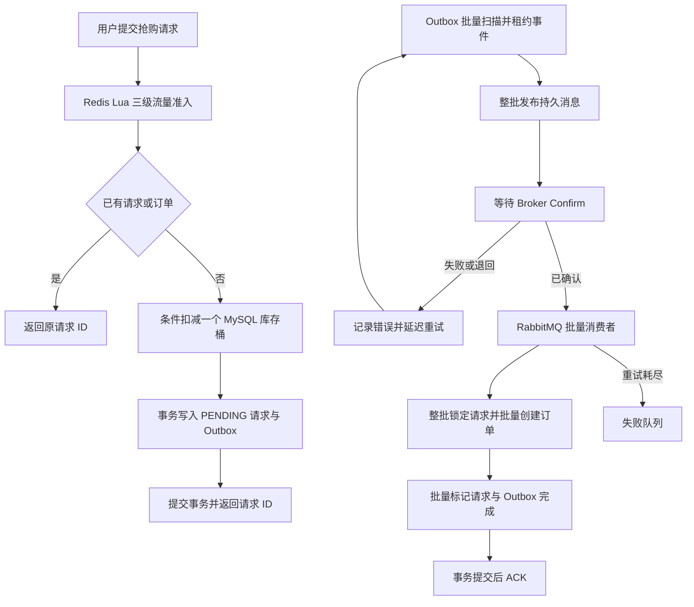

# 高并发活动交易平台 / Event Trading Platform

[简体中文](README.md) | [English](README.en.md)

基于 Java 21、Spring Boot、MySQL、Redis 和 RabbitMQ 的模块化单体交易后端。V1 活动链路同步创建订单并预占票档库存；仓库同时保留原有优惠券抢购与 Outbox/RabbitMQ 链路作为兼容能力。

## 当前实现范围

当前已实现活动、场次、票档的创建/发布/查询、带服务端价格快照和库存预占的同步订单创建与本人查询，以及未支付订单取消、数据库超时关单、幂等库存释放和重启补扫。源码已加入 V6 支付存储结构、独立事务的持久化模拟网关，以及 6.4 本地支付编排（正常支付原子确认、响应丢失记为 `UNKNOWN`、支付先赢时过期扫描无操作）。2026-09-17 通过 IDEA / Microsoft OpenJDK 21.0.7 验证支付 H2 10 项、支付 MySQL 8.4 集成 10 项、订单回归 8 项，均通过且退出码 0。支付 HTTP 接口、`UNKNOWN` 自动恢复、回调和晚到补偿退款未实现；当前关单后扣款仅保留成功支付并标记人工处理，不代表已退款。范围与证据见 [6.4 验证记录](docs/verification/CHECKLIST-6-4.md)，不代表第 6 项完整验收。

## 项目亮点

- **MySQL 交易事实源**：16 个库存桶分散单商品写热点，条件扣减与唯一约束防止超卖和重复下单；Redis 不保存最终交易状态。
- **V1 活动交易基线**：活动包含多个场次和票档；一单一票，价格从服务端票档快照，订单与 `RESERVED` 预占在同一 MySQL 事务提交。
- **短事务与过载保护**：幂等查询位于事务外，公平信号量限制数据库在途事务，并在过载时快速返回 `429`。
- **事务内记录发送意图**：库存扣减、请求记录和 Outbox 事件在同一事务中提交，最终订单由消费者创建。
- **异步消息处理**：实现 Outbox 租约批量发布、Confirm/Return 检查、持久化消息、消费端批量事务、失败队列和定时重发；这些机制不等于所有故障场景已验证。
- **请求幂等**：同一用户重复提交同一抢购请求时返回同一个请求 ID，不重复扣减库存。
- **分层流量控制**：一次基于 Redis `TIME` 的 Lua 令牌桶调用完成用户、单商品和全局三级准入检查。
- **可观测性**：独立管理端口暴露 Prometheus 指标，包括连接池、预留耗时、异步完成延迟、入口拒绝和 Outbox 积压。
- **安全边界**：Token 鉴权、管理员权限、验证码原子消费、接口限流和请求结束身份清理。
- **自动化验证**：最近完成验收的 0～5 基线通过 38 项默认测试；2 项隔离集成测试覆盖 Flyway V1～V5、真实 MySQL、Redis、RabbitMQ 与 1000 请求库存竞争，2 项真实 MySQL 生命周期测试覆盖 30 秒超时、取消/关单及下单/关单竞争、库存守恒和重启补扫。新增 V6 与模拟网关测试尚待 IDEA 复跑。

## 技术栈

- Java 21、Spring Boot 3.5
- Spring Security、MyBatis-Plus
- MySQL 8、Redis、RabbitMQ
- Maven、Docker Compose
- JUnit 5、H2、Mockito、Testcontainers、k6

## 兼容优惠券抢购链路



Publisher 同时检查 Confirm ACK 和 Return；Confirm 不证明消费者已完成业务，也不能单独证明路由到了预期队列。消费者本地事务将请求、最终订单与 Outbox 完成标记一起提交；Spring 监听容器随后确认消费。重复投递通过业务唯一约束和请求状态保护处理。

当前 Outbox 的 `completed` 表示消费业务已完成，而非仅发布成功。Broker 确认后事件仍可在租约到期后重发，直到消费者提交；消费者失败队列不会自动终止数据库 Publisher 的定时重发。因此这里不宣称端到端有限重试或完整 DLQ 重驱闭环。

## 已实现功能

### 账户与安全

- 手机验证码登录和 Token 鉴权。
- Token 滑动过期及主动登出。
- 管理接口角色校验。
- 验证码发送、校验和来源 IP 限流。
- 图片类型、大小、像素及所有者校验。

### 交易与一致性

- 活动、场次、票档的最小创建、发布、停售和公开查询。
- 同步活动订单创建、服务端 CNY 分价快照和独立预占记录。
- 同一用户和幂等键重放原订单；同用户同票档限购一单。
- 订单详情和列表按认证用户过滤，其他用户查询返回不存在。
- 优惠券及限时抢购。
- 数据库条件扣减库存。
- 单商品 16 个 MySQL 库存桶分散行锁竞争。
- 用户、单商品和全局三级流量准入。
- 公平在途事务限制和快速过载拒绝。
- 同一用户、同一优惠券的请求幂等。
- 订单请求状态查询：`PENDING`、`COMPLETED`。
- Transactional Outbox 批量发布和定时补发。
- RabbitMQ 持久化、Confirm、Return、并发消费、重试和失败队列。
- Prometheus 订单、连接池和 Outbox 指标。

### 现存兼容功能

仓库仍包含下列商户与社交接口，属于现存兼容范围，不代表活动交易领域已经完整实现：

- 商户查询缓存、空值缓存和逻辑过期。
- 商户分类查询。
- 笔记、点赞、关注和签到。
- 图片上传、读取和删除。

## 快速启动

### 环境要求

- Java 21
- Maven 3.6.3+
- Docker Desktop

### 1. 配置环境变量

在项目根目录创建 `.env`：

```properties
MYSQL_URL=jdbc:mysql://127.0.0.1:3307/event_trading?useSSL=false&serverTimezone=UTC&allowPublicKeyRetrieval=true
MYSQL_USER=root
MYSQL_PASSWORD=替换为本地密码

REDIS_HOST=127.0.0.1
REDIS_PORT=6380

RABBITMQ_HOST=127.0.0.1
RABBITMQ_PORT=5673
RABBITMQ_USER=event_app
RABBITMQ_PASSWORD=替换为本地密码
```

`.env` 已被 Git 忽略，请勿提交真实凭据。

### 2. 启动基础设施

```powershell
docker compose up -d
docker compose ps
```

默认端口：MySQL `3307`、Redis `6380`、RabbitMQ `5673`、RabbitMQ 管理界面 `15673`。

当前源码包含 Flyway `V1` 至 `V6`；其中 V6 新增本地支付/退款记录和独立模拟网关结果表，2026-09-17 的 `EventPaymentServiceIT` 已验证六个迁移在 MySQL 8.4 空库成功执行。已有本地库仅在确认已经包含历史基础表和订单/Outbox 升级后，才按版本 `2` 建立 baseline 并继续执行后续迁移；Flyway clean 已禁用。测试种子只位于 `src/test/resources`，不会写入开发数据库。

### 3. 启动应用

```powershell
mvn test
mvn '-Dspring-boot.run.profiles=local' spring-boot:run
```

服务地址：`http://127.0.0.1:8081`。`local` profile 会返回开发验证码，只能用于本机调试。

## 测试

默认测试不连接个人数据库：

```powershell
mvn test
```

2026-09-15 使用 IDEA 项目配置的 Microsoft OpenJDK 21.0.7 和 Maven 3.9.16 重新执行：**38 项通过，0 失败、0 错误、0 跳过**。

使用真实 MySQL、Redis 和 RabbitMQ 运行隔离集成测试：

```powershell
mvn -Pinfrastructure verify
```

同日通过 IDEA 直接运行 `InfrastructureIT`：**2 项通过，0 失败**。测试确认 Flyway `V1` 至 `V5` 在 MySQL 8.4 空库顺序执行，并覆盖真实 MySQL 活动下单、Redis、RabbitMQ，以及 1000 个有效请求竞争 100 张库存的验收：100 个预占成功、900 个业务拒绝、0 个技术失败，库存和预占明细守恒。另有 `EventOrderLifecycleIT` **2 项通过，0 失败**，覆盖 30 秒 TTL、1 秒扫描、取消与过期竞争、同票档下单与关单竞争、库存释放及重启补扫；应用就绪后约 43 ms 完成 4 个过期订单的恢复处理。默认单测另行验证失败订单的持久化退避不会饿死后续候选。Flyway 11.7.2 会提示其数据库识别表尚未认证 MySQL 8.4；迁移与断言实际通过，但该兼容提示保留为已知限制。IDEA 直接运行不会生成 Maven Failsafe 报告，上述结果以对应测试类的退出码 0 和完整控制台输出为证据。

## 并发压测

`loadtest/` 包含真实下单固定到达率脚本、隔离优惠券数据和自动过期的合成用户令牌。准备隔离数据后可执行：

```powershell
$env:RATE='1500'
$env:DURATION_SECONDS='10'
$env:VOUCHER_ID='9900021600'
$env:BASE_URL='http://127.0.0.1:8081'
k6 run .\loadtest\order-capacity.js
```

容量测试启动应用时将单商品/全局限流上限临时提高到 `5000`，避免保护阈值掩盖系统边界；日常默认值仍为单商品 `420/s`、全局 `800/s`。本地单实例测试环境：Windows 11、Java 21、Docker MySQL 8.4、Redis 7.4、RabbitMQ 4.1、k6 v2.2.0。每次请求调用真实鉴权下单接口并使用不同合成用户；RabbitMQ 消费与入口并行运行，测试后核对库存、请求、最终订单、重复订单和 Outbox。

已有记录中的 10 秒固定到达率结果（本次文档更新未重新压测）：

以下 P95 为下单 HTTP 请求耗时，不是异步成单或支付完成延迟；请求返回受理结果后，另行核对最终订单和 Outbox。各档位结果只适用于所述实验条件。

- 1000 目标 RPS：P95 34.69 ms，10001 个请求和最终订单，0 拒绝、0 异常、0 dropped iterations、重复订单 0、Outbox 0。
- 1200 目标 RPS：P95 12.77 ms，12001 个请求和最终订单，0 拒绝、0 异常、0 dropped iterations、重复订单 0、Outbox 0。
- 1400 目标 RPS：P95 17.1 ms，14001 个请求和最终订单，0 拒绝、0 异常、0 dropped iterations、重复订单 0、Outbox 0。
- 1500 目标 RPS：P95 14.82 ms，15001 个请求和最终订单，0 拒绝、0 异常、0 dropped iterations、重复订单 0、Outbox 0。
- 1600 目标 RPS：P95 109.13 ms，16001 次请求中 15848 次受理、153 次受控 `429`，0 非预期响应、0 dropped iterations；受理请求最终全部成单，重复订单 0、Outbox 0。

按 P95 小于 1 秒、无 `429`、无非预期响应、无 dropped iteration、无超卖/重复单且 Outbox 完全排空的严格口径，已有实验中最高通过档位为 1500 目标 RPS；1600 档位出现受控拒绝，未通过该口径。该结果是本地单实例、10 秒短时容量基线，不代表精确最大容量、生产 SLA、支付退款吞吐或长时间稳定性结论。

## 项目结构

```text
event-trading-platform/
├─ src/main/java/com/eventplatform/
│  ├─ config/          # 安全、数据库和消息配置
│  ├─ controller/      # HTTP API
│  ├─ order/           # 订单事务与 Outbox
│  ├─ security/        # Token、验证码和限流
│  ├─ service/         # 业务逻辑
│  └─ upload/          # 图片存储
├─ src/main/resources/
│  ├─ db/              # 建库及升级脚本
│  └─ mapper/          # MyBatis XML
├─ src/test/           # 单元、回归和集成测试
├─ docs/               # 架构与技术说明
├─ loadtest/           # k6 写链路压测与隔离数据
├─ postman/            # API 请求集合
├─ compose.yaml
└─ pom.xml
```

## 运行边界

- MySQL 是库存和订单的最终事实源；Redis 用于缓存、会话和流量准入。
- 同一商品库存分散到 16 个 MySQL 行桶，查询库存时汇总各桶；现有数据库使用 `db/performance-upgrade.sql` 迁移。
- 旧抢购接口返回请求 ID，最终优惠券订单由 RabbitMQ 消费者异步创建；`/api/v1/orders` 活动订单则在本地事务中同步创建。
- 管理端口 `127.0.0.1:8082` 仅暴露健康检查与 Prometheus 指标。
- 本地 Compose 用于开发和验证，不代表生产部署环境。

## 相关文档

以下架构文档包含目标设计，阅读时应与上面的当前实现范围区分。

- [安全及一致性说明](docs/SECURITY-FIXES.md)
- [领域模型设计](docs/architecture/DOMAIN-MODEL.md)
- [业务状态机设计](docs/architecture/STATE-MACHINES.md)
- [API 契约设计](docs/architecture/API-CONTRACT.md)
