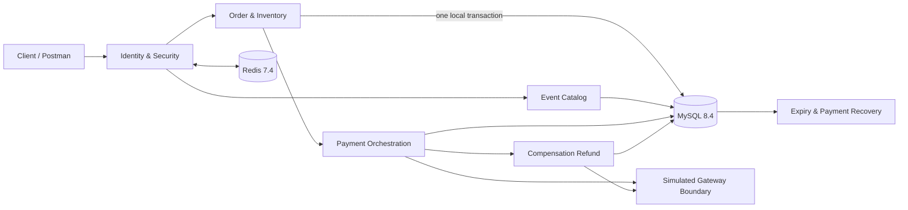

<div align="center">

# Event Trading Platform

### 面向活动交易的 Java 后端：订单、库存、支付与故障恢复

**同步下单 · 库存守恒 · 幂等重试 · 支付 UNKNOWN 恢复 · 关单竞争 · 晚到支付补偿**

[](https://openjdk.org/projects/jdk/21/)
[](https://spring.io/projects/spring-boot)
[](https://www.mysql.com/)
[](#验证证据)
[](https://github.com/ctmd1234567/event-trading-platform/actions/workflows/ci.yml)

[English](README.en.md) · [领域模型](docs/architecture/DOMAIN-MODEL.md) · [状态机](docs/architecture/STATE-MACHINES.md) · [API 合同](docs/architecture/API-CONTRACT.md) · [V1 验收记录](docs/verification/V1-VERIFICATION.md)

</div>

---

## 项目重点

项目围绕 Event 交易的事务边界与故障恢复实现，关键行为均有对应测试和验收记录：

- **库存是事务事实，不是缓存猜测**：下单在一个 MySQL 本地事务中创建订单、预占明细并更新 `available / reserved / allocated`，始终满足库存守恒。
- **网络超时不等于支付失败**：请求超时进入 `UNKNOWN / PROCESSING`，复用同一业务号通过回调、主动查询与重启恢复收敛，避免重复扣款。
- **竞争结果由提交顺序决定**：支付先赢则完成分配；关单先赢则释放库存，之后确认的扣款生成唯一全额补偿退款，订单不会被错误“复活”。
- **测试主动制造坏路径**：真实 MySQL 行锁、并发屏障、响应丢失注入、重复回调与重启恢复用于证明边界，而不是用 `sleep` 猜竞态。

## 一眼看懂架构



默认产品的交易核心仍为同步 MySQL 事务。支付成功和订单关闭在同一事务写入站内通知 Outbox；RabbitMQ 只承载通知副作用，不创建核心订单。第 9 项补齐停机恢复、有限消费重试、DLQ 与管理员审计重驱；旧 Voucher 消息实验仍由独立 profile 隔离。

## 核心业务闭环

```text
DRAFT Event
   └─ publish ─> ON SALE
                    └─ create order ─> PENDING_PAYMENT + RESERVED
                                           ├─ payment wins ─> PAID + CONFIRMED + allocated
                                           └─ cancel/expire ─> CLOSED + RELEASED + available
                                                                    └─ late charge
                                                                        └─ one compensation refund
```

固定的 V1 规则：一单一票、CNY 整数分、同用户同票档限购一单、同幂等键同载荷返回原结果、成交后退款不回售。

## 已实现能力

### Event 与同步交易

- 活动、场次、票档创建、发布、停售与公开查询
- 服务端价格快照、销售窗口校验和用户所有权隔离
- 同步订单创建、独立库存预占记录、幂等键与购买限制
- 1000 个并发请求竞争 100 张票：100 成功、900 明确业务冲突、0 技术失败

### 生命周期与恢复

- 用户取消与超时关单共享同一事务边界
- 固定锁顺序：`order → reservation → ticket tier`
- 持久化过期扫描、失败退避与应用重启补扫
- 取消/过期、下单/释放并发下仍保持库存守恒

### 支付与补偿

- 模拟网关使用独立提交边界，不与本地订单事务混在一起
- 支付创建、查询、刷新、签名回调和持久化恢复
- `UNKNOWN / PROCESSING / MANUAL_REQUIRED` 可查询，不把不确定状态伪装成成功或失败
- 关单后晚到支付创建唯一全额补偿退款；补偿不二次修改库存
- ADMIN 人工接管使用同业务号、幂等键、原因和审计记录

## 验证证据

2026-09-19 使用 Microsoft OpenJDK 21.0.7 和 Maven 3.9.16 验证当前 V1 候选：

- **65 个默认测试**：身份、安全、Event、库存事务、支付服务、控制器和模拟网关
- **58 个 infrastructure profile 集成测试**：其中 57 个覆盖 Event V1，另 1 个隔离验证历史 RabbitMQ 实验
- **合计 123 个测试**：0 失败、0 错误、0 忽略；`mvn -Pinfrastructure verify` 同时执行默认套件与 Testcontainers 集成套件
- **Event 下单基线**：200 次认证 `POST /api/v1/orders`，100 成功、100 明确业务冲突、0 技术失败、0 丢弃；P50/P95/P99 为 0.012996/0.040840/0.048521 秒，库存与关联审计全部通过

完整命令、Demo、版本、数据库审计与限制见 [V1 验收记录](docs/verification/V1-VERIFICATION.md) 和 [Event 下单基线结果](docs/verification/results/event-order-creation-baseline-20260919.md)。Flyway 11.7.2 对 MySQL 8.4 仍有版本认证提示；迁移与断言实际通过，这不是生产兼容性认证。

## 运行

### 环境

- Java 21
- Maven 3.9+
- Docker Desktop / Docker Engine

在项目根目录创建未跟踪的 `.env`：

```properties
MYSQL_URL=jdbc:mysql://127.0.0.1:3307/event_trading?useSSL=false&serverTimezone=UTC&allowPublicKeyRetrieval=true
MYSQL_USER=root
MYSQL_PASSWORD=replace-with-a-local-password
REDIS_HOST=127.0.0.1
REDIS_PORT=6380
ADMIN_USER_IDS=1
RABBITMQ_USER=event_app
RABBITMQ_PASSWORD=replace-with-a-local-password
RABBITMQ_PORT=5673
EVENT_NOTIFICATIONS_ENABLED=true
```

### 启动与验证

```bash
docker compose up -d
docker compose ps
mvn test
mvn -Dspring-boot.run.profiles=local spring-boot:run
```

默认 Compose 启动 MySQL、Redis 与持久化单节点 RabbitMQ；若暂不运行通知，可设 `EVENT_NOTIFICATIONS_ENABLED=false`，交易仍写入待发 Outbox。应用地址为 `http://127.0.0.1:8081`，管理端点仅监听 `127.0.0.1:8082`。`local` profile 会返回本地验证码，禁止暴露到公网。

真实依赖集成测试使用隔离 Testcontainers，不写个人开发库：

```bash
mvn -Pinfrastructure verify
```

### V1 Demo

以 `local` profile 启动应用，且让 `ADMIN_USER_IDS` 包含演示 ADMIN 身份；也可传入已登录且已加入 allowlist 的 `DEMO_ADMIN_TOKEN`。脚本动态创建 Event、Session 和三个独立 TicketTier，不依赖历史业务 ID。演示超时关单时，以 30 秒支付窗口启动应用：

```bash
EVENT_ORDER_PAYMENT_WINDOW_SECONDS=30 mvn -Dspring-boot.run.profiles=local spring-boot:run
bash scripts/demo-v1.sh
```

Demo 覆盖登录、动态建档与发布、公开查询、幂等下单与支付、越权读取拒绝、用户取消、超时关单，以及最终订单、支付和三档库存守恒。已有 Event 请求集合仍位于 [`postman/collections/Event-V1.postman_collection.json`](postman/collections/Event-V1.postman_collection.json)。

Event 下单基线使用隔离 Event/TicketTier 和 Redis 会话，由独立认证用户并发调用 `POST /api/v1/orders`，记录成功、业务冲突、技术失败及 P50/P95/P99，并在结束时审计库存守恒和异常重复订单/预留：

```bash
RESULT_FILE=docs/verification/results/event-order-creation-baseline.md \
  bash loadtest/event-trading-baseline.sh
```

## API 导航

- 公开目录：`GET /api/v1/events`、`GET /api/v1/events/{id}`
- ADMIN 建档：`POST /api/v1/admin/events`、场次、票档、发布与停售命令
- 用户订单：`POST /api/v1/orders`、查询、列表、取消
- 支付与退款：创建/查询/刷新支付，用户申请全额退款，查询/刷新退款
- 可信回调：`POST /api/v1/payment-callbacks/simulated`
- ADMIN 接管：查询恢复工作、同号重试支付/退款、针对性对账与安全修复

请求和状态语义以 [API 合同](docs/architecture/API-CONTRACT.md) 为准。

## 项目结构

```text
src/main/java/com/eventplatform/
├── catalog/       Event、Session、TicketTier
├── controller/    Event、Order、Payment、Identity、Notification API
├── notification/  Event Outbox、RabbitMQ 发布消费、站内通知查询
├── order/         同步订单、库存、关单；隔离的历史工程实验
├── payment/       网关边界、回调、UNKNOWN 恢复、全额退款与针对性对账
├── security/      Token、验证码、权限与限流
├── service/       最小身份服务
└── config/        Security、MyBatis、实验 Rabbit 配置

src/main/resources/db/migration/   Flyway V1～V6 不可回写；V7～V9 为前向迁移
src/test/                         单元、并发与 Testcontainers 验收
docs/                             架构、状态机、API 与验证证据
postman/                          Event V1 请求集合与本地环境
scripts/                          V1 联合 Demo
loadtest/                         Event 基线与隔离的历史工程实验
```

## 当前边界与路线图

- 当前完成：V1 Core Trading；证据见 [V1 验收记录](docs/verification/V1-VERIFICATION.md)
- V2 第 8 项：Event Notification Outbox/MQ 与站内通知；实现与验收见 [第 8 项记录](docs/verification/CHECKLIST-8-EVENT-NOTIFICATIONS.md)
- V2 第 9 项：Broker 停机恢复、通知 DLQ 与管理员重驱；测试条件、迁移和限制见 [第 9 项记录](docs/verification/CHECKLIST-9-MQ-RECOVERY.md)
- V2 第 10 项：用户全额退款与针对性对账；实现、验证和限制见 [第 10 项记录](docs/verification/CHECKLIST-10-REFUND-RECONCILIATION.md)
- V2 后续：SQL、负载与依赖故障证据
- V3：按需要选择 Soak、告警、备份恢复等增强；不是项目完成门槛

未实现：SSE 推送、通用对账框架和完整 OpenAPI。站内通知可由登录用户通过 `GET /api/v1/notifications` 查询最近 100 条；管理员可在确认原因后审计重驱。DLQ 和单节点持久化不构成零丢失保证。

高并发工程实验（隔离的 Voucher/Outbox/RabbitMQ 写链路，包含失败冷启动轮次、限制和原始证据）：[1500 RPS 实验记录](docs/verification/CONCURRENCY-EXPERIMENT-1500-RPS-2026-09-18.md)。该实验不代表 Event 性能、生产 SLA 或长期稳定性。

## 设计文档

- [领域模型与事务边界](docs/architecture/DOMAIN-MODEL.md)
- [订单、支付与退款状态机](docs/architecture/STATE-MACHINES.md)
- [API 合同](docs/architecture/API-CONTRACT.md)
- [支付边界设计](docs/architecture/PAYMENT-BOUNDARY-DESIGN.md)
