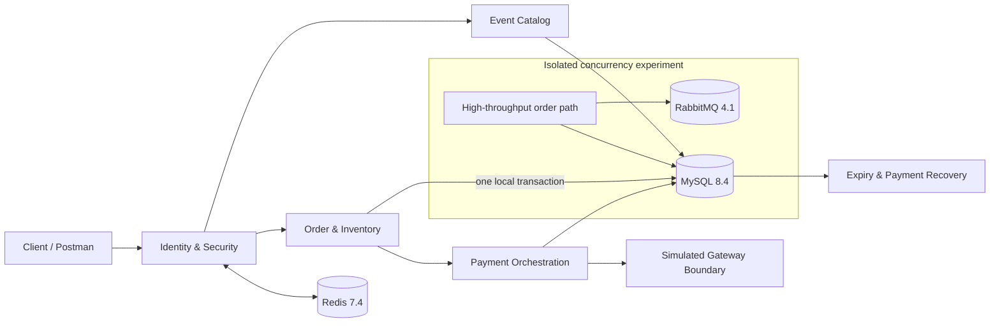

<div align="center">

# Event Trading Platform

### 把高并发交易里最难讲清的部分，做成可运行、可验证的 Java 后端

**同步下单 · 库存守恒 · 幂等重试 · 支付 UNKNOWN 恢复 · 关单竞争 · 晚到支付补偿**

[](https://openjdk.org/projects/jdk/21/)
[](https://spring.io/projects/spring-boot)
[](https://www.mysql.com/)
[](#验证证据)
[](docs/verification/CONCURRENCY-EXPERIMENT-1500-RPS-2026-09-18.md)
[](https://github.com/ctmd1234567/event-trading-platform)

[English](README.en.md) · [领域模型](docs/architecture/DOMAIN-MODEL.md) · [状态机](docs/architecture/STATE-MACHINES.md) · [API 合同](docs/architecture/API-CONTRACT.md) · [验收记录](docs/verification/CHECKLIST-0-6.md)

</div>

---

## 为什么这个项目值得看

这不是把技术名词堆在 README 里的票务 CRUD。项目围绕真实交易失败边界设计，并为关键结论提供确定性测试：

- **库存是事务事实，不是缓存猜测**：下单在一个 MySQL 本地事务中创建订单、预占明细并更新 `available / reserved / allocated`，始终满足库存守恒。
- **网络超时不等于支付失败**：请求超时进入 `UNKNOWN / PROCESSING`，复用同一业务号通过回调、主动查询与重启恢复收敛，避免重复扣款。
- **竞争结果由提交顺序决定**：支付先赢则完成分配；关单先赢则释放库存，之后确认的扣款生成唯一全额补偿退款，订单不会被错误“复活”。
- **测试主动制造坏路径**：真实 MySQL 行锁、并发屏障、响应丢失注入、重复回调与重启恢复用于证明边界，而不是用 `sleep` 猜竞态。

## 一眼看懂架构



默认产品运行时只启用 Identity/Security、Event Catalog、同步 Order/Inventory、Payment/Compensation 和恢复任务。RabbitMQ 仅用于隔离的高并发订单工程实验，不参与 Event 核心订单创建。

## 核心业务闭环

```text
DRAFT Event
   └─ publish ─> ON SALE
                    └─ create order ─> PENDING_PAYMENT + RESERVED
                                           ├─ payment wins ─> PAID + CONFIRMED + allocated
                                           └─ cancel/expire ─> CLOSED + RELEASED + available
                                                                    └─ late charge
                                                                        └─ one compensation refund
```

固定的 V1 规则：一单一票、CNY 整数分、同用户同票档限购一单、同幂等键同载荷返回原结果、成交后退款不回售。

## 已实现能力

### Event 与同步交易

- 活动、场次、票档创建、发布、停售与公开查询
- 服务端价格快照、销售窗口校验和用户所有权隔离
- 同步订单创建、独立库存预占记录、幂等键与购买限制
- 1000 个并发请求竞争 100 张票：100 成功、900 明确业务冲突、0 技术失败

### 生命周期与恢复

- 用户取消与超时关单共享同一事务边界
- 固定锁顺序：`order → reservation → ticket tier`
- 持久化过期扫描、失败退避与应用重启补扫
- 取消/过期、下单/释放并发下仍保持库存守恒

### 支付与补偿

- 模拟网关使用独立提交边界，不与本地订单事务混在一起
- 支付创建、查询、刷新、签名回调和持久化恢复
- `UNKNOWN / PROCESSING / MANUAL_REQUIRED` 可查询，不把不确定状态伪装成成功或失败
- 关单后晚到支付创建唯一全额补偿退款；补偿不二次修改库存
- ADMIN 人工接管使用同业务号、幂等键、原因和审计记录

## 验证证据

2026-09-18 使用 IntelliJ IDEA 2026.1.3 和 Microsoft OpenJDK 21.0.7 验证当前清理候选：

- **65 个默认测试**：身份、安全、Event、库存事务、支付服务、控制器和模拟网关
- **31 个 Event 集成测试**：`EventInfrastructureIT` 3、`EventOrderLifecycleIT` 2、`PaymentBoundaryIT` 26
- **1 个隔离实验测试**：`LegacyMessagingIT` 在 Testcontainers MySQL/Redis/RabbitMQ 上验证保留链路
- IDEA 全量重建成功，0 个编译问题；上述 97 个测试方法均为 0 失败、0 忽略

完整证据与限制见 [0～6 验收记录](docs/verification/CHECKLIST-0-6.md) 和 [清理验收记录](docs/verification/REFACTORING-STAGE-D-E-ACCEPTANCE.md)。Flyway 11.7.2 对 MySQL 8.4 仍有版本认证提示；迁移与断言实际通过，这不是生产兼容性认证。

## 快速开始

### 1. 环境

- Java 21
- Maven 3.9+
- Docker Desktop / Docker Engine

在项目根目录创建未跟踪的 `.env`：

```properties
MYSQL_URL=jdbc:mysql://127.0.0.1:3307/event_trading?useSSL=false&serverTimezone=UTC&allowPublicKeyRetrieval=true
MYSQL_USER=root
MYSQL_PASSWORD=replace-with-a-local-password
REDIS_HOST=127.0.0.1
REDIS_PORT=6380
ADMIN_USER_IDS=1
```

### 2. 启动与验证

```bash
docker compose up -d
docker compose ps
mvn test
mvn -Dspring-boot.run.profiles=local spring-boot:run
```

默认 Compose 只启动 MySQL 与 Redis。应用地址为 `http://127.0.0.1:8081`，管理端点仅监听 `127.0.0.1:8082`。`local` profile 会返回本地验证码，禁止暴露到公网。

真实依赖集成测试使用隔离 Testcontainers，不写个人开发库：

```bash
mvn -Pinfrastructure verify
```

### 3. 高并发工程证据

独立的异步订单实验用于保存分桶库存、准入保护、Outbox 与批量消费成果，不属于默认产品启动步骤。最新 1500 RPS 实测、原始 k6 摘要与数据库终态见 [并发实验复测记录](docs/verification/CONCURRENCY-EXPERIMENT-1500-RPS-2026-09-18.md)。

## API 导航

- 公开目录：`GET /api/v1/events`、`GET /api/v1/events/{id}`
- ADMIN 建档：`POST /api/v1/admin/events`、场次、票档、发布与停售命令
- 用户订单：`POST /api/v1/orders`、查询、列表、取消
- 支付恢复：创建支付、查询/刷新支付与补偿退款
- 可信回调：`POST /api/v1/payment-callbacks/simulated`
- ADMIN 接管：查询恢复工作、同号重试支付/退款

请求和状态语义以 [API 合同](docs/architecture/API-CONTRACT.md) 为准。

## 项目结构

```text
src/main/java/com/eventplatform/
├── catalog/       Event、Session、TicketTier
├── controller/    Event、Order、Payment、Identity API
├── order/         同步订单、库存、关单；隔离的历史工程实验
├── payment/       网关边界、回调、UNKNOWN 恢复、补偿退款
├── security/      Token、验证码、权限与限流
├── service/       最小身份服务
└── config/        Security、MyBatis、实验 Rabbit 配置

src/main/resources/db/migration/   Flyway V1～V6（不可回写）
src/test/                         单元、并发与 Testcontainers 验收
docs/                             架构、状态机、API 与验证证据
loadtest/                         历史工程实验；不代表 Event 性能
```

## 当前边界与路线图

- 当前完成：V1 清单 0～6，以及旧业务清理和默认运行时收敛
- 下一步：第 7 项 Event 联合 Demo、请求集合和真实写链路基线
- V2：Event Notification Outbox/MQ、DLQ/redrive、用户全额退款、针对性对账和故障证据
- V3：按需要选择 Soak、告警、备份恢复等增强；不是项目完成门槛

未实现：用户主动退款、Event 通知/SSE、Event Outbox/DLQ、通用对账框架和第 7 项性能基线。

<details>
<summary><strong>1500 RPS 高并发订单工程实验</strong></summary>

2026-09-18 在当前清理候选上完成本地单实例、10 秒恒定到达率复测：预热后 15,001 个请求全部接受并最终成单，HTTP P95 106.51 ms，0 个 429、HTTP 失败、异常响应、丢弃迭代和重复用户订单；Outbox 与 Rabbit 队列最终均为 0。首次冷启动轮未通过严格门槛，因此同时保留，不从证据中删除。该结果验证分桶库存、准入保护、Outbox 与批量消费链路，不代表 Event 支付吞吐、生产 SLA 或长期稳定性。详见 [原始证据与完整边界](docs/verification/CONCURRENCY-EXPERIMENT-1500-RPS-2026-09-18.md)。

</details>

## 设计文档

- [领域模型与事务边界](docs/architecture/DOMAIN-MODEL.md)
- [订单、支付与退款状态机](docs/architecture/STATE-MACHINES.md)
- [API 合同](docs/architecture/API-CONTRACT.md)
- [支付边界设计](docs/architecture/PAYMENT-BOUNDARY-DESIGN.md)
- [工程资产登记](docs/verification/REFACTORING-STAGE-A-ASSET-REGISTER.md)

如果这个项目里的失败边界、测试方法或取舍对你有帮助，欢迎点一个 ⭐，也欢迎带着具体场景提 Issue。
