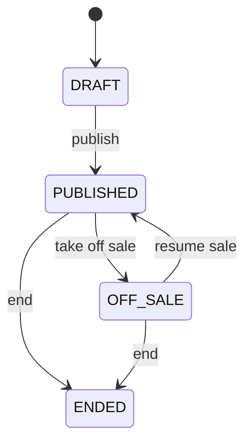
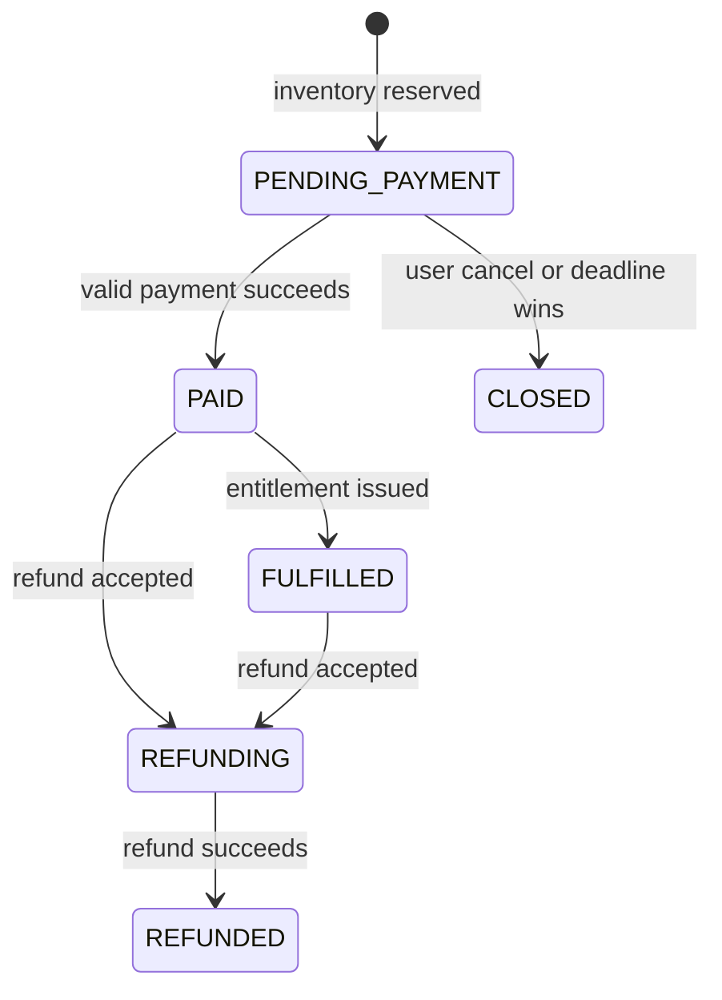
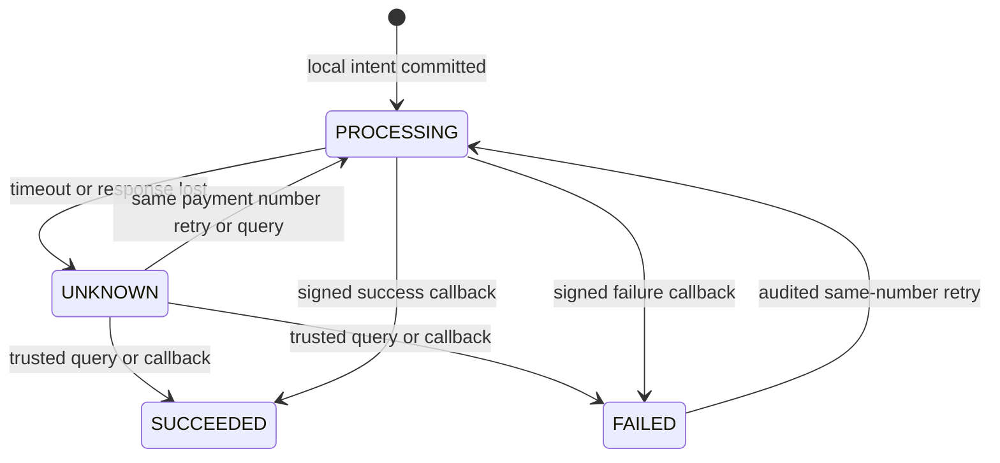
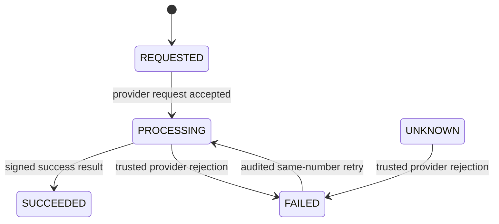
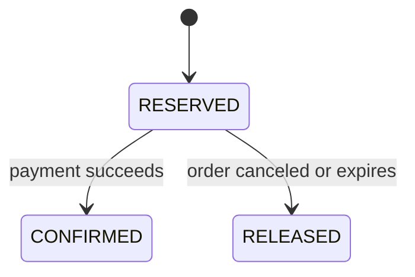

# State Machines

## General Rules

- State transitions are commands, not arbitrary field updates.
- Every transition verifies the current state with a conditional update or row lock.
- Repeating a completed transition is a no-op that returns the committed result.
- Invalid transitions are rejected; the API does not expose a stable machine error-code field.
- State and its applicable history change in one transaction. Order payment confirmation and closure include their notification Outbox intent in the same transaction.
- Consumers and callbacks may arrive more than once or out of order.

## Event

- Publishing requires at least one valid session and ticket tier.
- Resuming requires a future sellable session.
- `ENDED` is terminal; published events cannot be deleted.

## Order

Rules:

- Payment and closure determine the pending order outcome. User full refund moves an eligible paid order through `REFUNDING` to `REFUNDED`. `FULFILLED` is represented in the model, but no separate fulfillment command is implemented.
- `PENDING_PAYMENT` owns a `RESERVED` inventory reservation.
- `PAID` and `FULFILLED` own a `CONFIRMED` reservation.
- `CLOSED` owns a `RELEASED` reservation; `closeReason` distinguishes cancellation from expiration.
- A late payment for `CLOSED` never reopens the order. It creates one compensating full refund and a visible recovery record.
- Timeout and payment processing compete on the same guarded transition; exactly one wins.
- A failed or unknown user refund leaves the order `REFUNDING` until audited retry or recovery resolves it.
- `CLOSED` and `REFUNDED` are terminal.

## Payment

Rules:

- `SUCCEEDED` is immutable; refunds are separate aggregates.
- Duplicate callbacks with the same provider transaction and payload are acknowledged without repeated effects.
- Conflicting amount, currency, order, or payload is rejected and audited.
- Unknown callbacks are stored for reconciliation instead of discarded.
- Transport timeout, HTTP 500, or connection reset produces `UNKNOWN`, not `FAILED`.
- Payment success updates payment, order, reservation, inventory, and payment
  history atomically. A successful order transition writes its notification Outbox intent in the same local transaction.

## Refund

Rules:

- `SUCCEEDED` is terminal.
- Late-payment compensation and user-requested full refunds share the same recovery path. Each payment has at most one refund, and gateway retries reuse its refund number.
  Operator retry idempotency is audited separately.
- Late-payment compensation leaves the order `CLOSED`. A successful user refund
  changes `REFUNDING` to `REFUNDED` in the same transaction as the local refund result.
- Refund success does not change inventory: normal paid inventory remains allocated, while a closed order was already released.
- Automatic retries are bounded; exhaustion preserves the current business state
  and marks `MANUAL_REQUIRED`. Explicit provider failure also requires an audited
  operator retry. Manual handling is not refund success.

## Inventory Reservation

- Every transition is guarded by the previous state.
- Releasing an already released reservation is a no-op.
- Inventory counters and reservation state change in one transaction.
- `CONFIRMED` is represented by allocated inventory and is never returned to sale by refund.
- Reconciliation calculates expected counters from reservations and reports discrepancies before repair.

## Race Resolution

### Payment callback versus timeout or cancellation

1. Both operations require `PENDING_PAYMENT`.
2. Both lock or conditionally update the same order.
3. The first committed transition wins.
4. If cancellation or timeout wins, later payment success triggers a compensating refund.
5. If payment wins, cancellation or timeout performs no state change.

### Duplicate or out-of-order messages

The notification consumer uses unique `et_notification.event_id` in the same transaction as its in-app effect. A duplicate commits no second effect and is acknowledged. Failed deliveries are recorded and can enter the DLQ for reviewed redrive.
